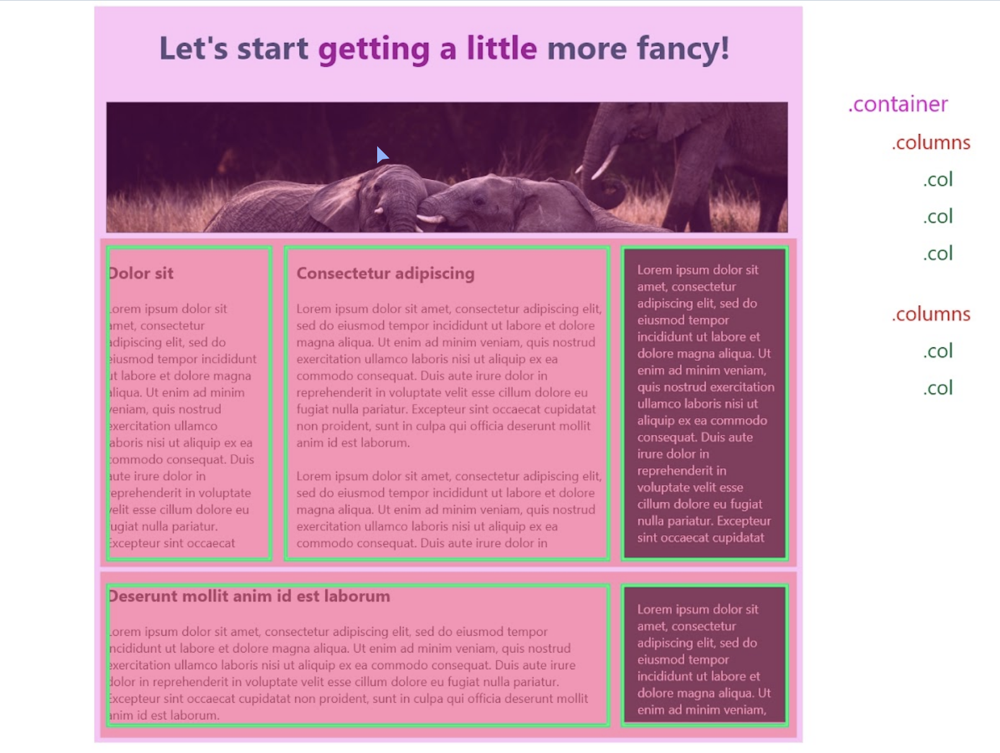
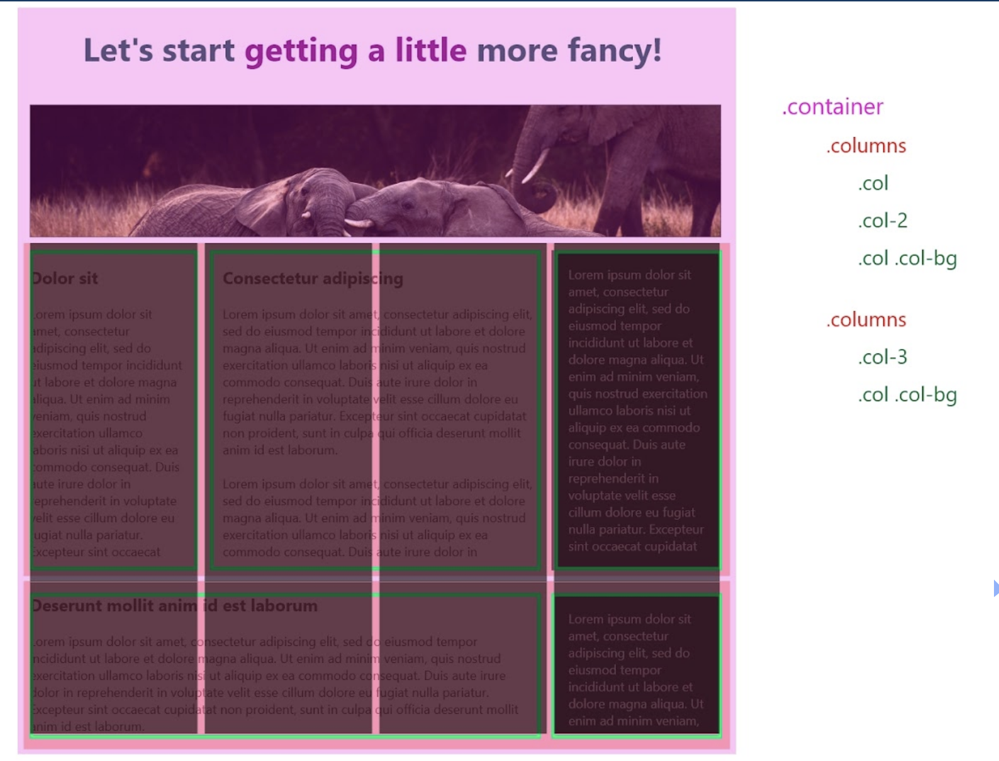

# Concepts I've learned in this project

- Identifying the rows of the layout that have 2 ore more columns (adding a .columns class to the div element indiciating that div element have columns inside) I need (display: flex). In this case 2 rows (.column). The first row has 3 columns (.col) and the second row has 2 columns. 

- Breaking the layout in 4 columns (so I can set a width (in %) to each column)
